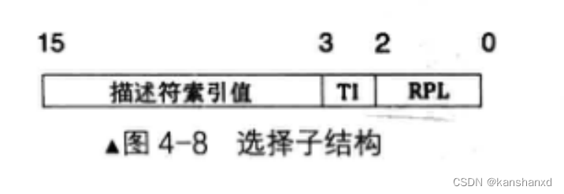

# booting 

- what is booting ?
- why we need booting ?
- how to make a computer boot ?


引导流程：


# firmware: bios vs. uefi

- 一个小 “操作系统”
    - 管理、配置硬件；加载操作系统
- legacy bios (basic i/o system) 
    - bios + mbr (master boot record)

- uefi (unified extensible firmware interface)
    - uefi + gpt (guid partition table)


# 实现一个简单的 mbr 

- 方法一：使用bios 中断
  - 0x10 号中断 
    - ah :0x0e 打印al中的字符

```asm
[org 0x7c00]

; 设置屏幕模式为文本模式，清除屏幕
mov ax, 3
int 0x10

; 初始化段寄存器
mov ax, 0
mov ds, ax
mov es, ax
mov ss, ax
mov sp, 0x7c00

mov si, booting
call print
mov si, booting
call print

; 阻塞
jmp $

print:
    mov ah, 0x0e
.next:
    mov al, [si]
    cmp al, 0
    jz .done
    int 0x10
    inc si
    jmp .next
.done:
    ret

booting:
    db "hello os world! booting in mbr", 10, 13, 0 ; \n\r
  
times 510-($-$$) db 0
db 0x55,0xaa
```
---
# 实现一个稍微复杂的 mbr
- goal : 将 boot loader 加载刀内存中，然后跳转到 boot loader 中执行


- 如何加载 boot loader 到内存中 ?
  - boot loader 在磁盘得哪个位置 ?  2 sector
  - 如何知道 boot loader 的大小 ? 4 sector 
  - 将 boot loader 加载到内存的哪个位置 ? 0x1000


---

# 让 mbr 使用硬盘
接下来我们要用mbr做点实事了，mbr只有512byte，能做的事情非常少，所以不能指望它做完所有事情。所以，我们用它把操作系统的loader加载到指定位置，然后跳转到loader执行，loader由于大小可以比mbr大得多，所以能做的就很多了。所以，mbr要加载loader，就必须要和磁盘打交道。打交道的方式很简单，就是通过in 与out指令与磁盘暴露在外的寄存器交互。

in指令用于从端口读数据，一般形式为：

- in al,dx
- in ax,dx
其中 al 和 ax 用来存储从端口获取的数据，dx 是指端口号。

这是固定用法，只要用 in 指令，源操作数（端口号）必须是 dx，而目的操作数是用 al，还是 ax，取决于 dx 端口指代的寄存器是 8 位宽度，还是 16 位宽度。

out指令用于往端口中写数据，其一般形式是：

- out dx, al；
- out dx,ax；
- out 立即数, al；
- out 立即数, ax。
磁盘端口寄存器对应的用途

其中status与device寄存器比较复杂，它们的结构的含义如下：


### 硬盘操作的七个步骤：

- 先选择通道，往该通道的 sector count 寄存器中写入待操作的扇区数。
- 往该通道上的三个 lba 寄存器写入扇区起始地址的低 24 位。
- 往 device 寄存器中写入 lba 地址的 24～27 位，并置第 6 位为 1，使其为 lba 模式，设置第 4 位，选择操作的硬盘（master 硬盘或 slave 硬盘）。
- 往该通道上的 command 寄存器写入操作命令。
- 读取该通道上的 status 寄存器，判断硬盘工作是否完成。
- 如果以上步骤是读硬盘，进入下一个步骤。否则，完工。
- 将硬盘数据读出。


/src/boot/boot.asm
```asm
                                    ;主引导程序 
                                    ;------------------------------------------------------------
section mbr vstart=0x7c00         
    mov ax,0                       ; cs = 0
    mov ds,ax
    mov es,ax
    mov ss,ax
    mov fs,ax
    mov sp,0x7c00
    mov ax,0xb800
    mov gs,ax


    mov ax,3
    int 0x10

    mov si, booting
    call print
	 
    mov eax,0x02            	    ; 起始扇区lba模式地址 lba地址长度为28
    mov bx,0x1000                   ; 写入的地址
    mov cx,4			            ; 待读入的扇区数
    call rd_disk_m_16		        ; 以下读取程序的起始部分（一个扇区）
    
    cmp word [0x1000],0x55aa        ; 判断是否为有效的引导扇区
    jnz error                       ; 如果不是则跳转到error

    jmp 0:0x1000                    ; 跳转到loader

print:
    mov ah,0x0e
.next:
    mov al,[si]
    cmp al,0
    jz .done
    int 0x10
    inc si
    jmp .next
.done:
    ret
booting:
    db "booting...",10,13,0
error:
    mov si, .msg
    call print
    hlt ; 让cpu 停止
    .msg db "loading error !!!",10,13,0
                                    ;-------------------------------------------------------------------------------
                                    ;功能:读取硬盘n个扇区
rd_disk_m_16:	   
                                    ;-------------------------------------------------------------------------------
				                    ; eax=lba扇区号
				                    ; ebx=将数据写入的内存地址
				                    ; ecx=读入的扇区数
    mov esi,eax	                    ;备份eax
    mov di,cx		                ;备份cx
                                    ;读写硬盘:
                                    ;第1步：选择特定通道的寄存器(sector count)，设置要读取的扇区数 (1)
    mov dx,0x1f2                    ;见 primary 通道设置为 0x1f2 选择的是sector count 寄存器
    mov al,cl                       ; cl = 1
    out dx,al                       ;读取的扇区数

    mov eax,esi	                    ;恢复exa 即 loader 存放扇区的地址( 0x900) 

                                    ;第2步：在特定通道寄存器中放入要读取扇区的地址(0x900)，将lba地址存入0x1f3 ~ 0x1f6
                                    ;lba地址7~0位写入端口0x1f3
    mov dx,0x1f3                       
    out dx,al                          

                                    ;lba地址15~8位写入端口0x1f4
    mov cl,8                        
    shr eax,cl                      ; shr 将exa右移 cl(8) 位, 
    mov dx,0x1f4
    out dx,al

                                    ;lba地址23~16位写入端口0x1f5
    shr eax,cl
    mov dx,0x1f5
    out dx,al
                                    ;设置device寄存器的值，lba地址的24 ~ 27位放入device 的低四位，高四位设置为1110
    shr eax,cl
    and al,0x0f	                    ;lba第24~27位 lba 地址长度28 所以这里只有低四位有意义 
    or al,0xe0	                    ;设置7～4位为1110,表示lba模式且选择主盘
    mov dx,0x1f6
    out dx,al

                                    ;第3步：向0x1f7端口写入 读命令(0x20) 
    mov dx,0x1f7
    mov al,0x20                        
    out dx,al

                                    ;第4步：检测硬盘状态
.not_ready:
                                    ;同一端口，写时表示写入命令字，读时表示读入硬盘状态
    nop
    in al,dx
    and al,0x88	                    ;第4位为1表示硬盘控制器已准备好数据传输，第7位为1表示硬盘忙
    cmp al,0x08
    jnz .not_ready	                ;若未准备好，继续等。

                                    ;第5步：从0x1f0端口读数据
    mov ax, di                      ;di当中存储的是要读取的扇区数(1)
    mov dx, 256                     ;每个扇区512字节，一次读取两个字节，所以一个扇区就要读取256次，与扇区数相乘，就等得到总读取次数
    mul dx                          ;8位乘法与16位乘法知识查看书p133,注意：16位乘法会改变dx的值！！！！
    mov cx, ax	                    ; 得到了要读取的总次数，然后将这个数字放入cx中
    mov dx, 0x1f0                   ;设置读端口寄存器
.go_on_read:
    in ax,dx
    mov [ds:bx],ax
    add bx,2		  
    loop .go_on_read
    ret


    times 510-($-$$) db 0
    db 0x55,0xaa


```
---
# 实现一个 简单的 boot loader

goal : 切换到保护模式，加载内核到内存的指定跳转到内核中执行

## 什么是保护模式？

### 8086 cpu 实模式

8086 cpu 有 20 条地址线，可以寻址 1mb 的内存空间

拥有1mb的寻址能力，怎样用 16 位的寄存器表示呢？

这就引出了分段的概念，8086cpu将1mb存储空间分成许多逻辑段，每个段最大限长为64kb（但不一定就是64kb）。这样每个存储单元就可以用“段基地址+段内偏移地址”表示。这样就实现了从16位内部地址到20位实际地址的转换（映射）。段基地址由16位段寄存器值左移4位表达，段内偏移表示相对于某个段起始位置的偏移量。

**段寄存器<<4 + 逻辑地址（16位）= 线性地址 = 物理地址**

### 80386 cpu 保护模式

80386 cpu 有 32 条地址线，可以寻址 4gb 的内存空间，但是为了兼容性考虑，保留了之前的段寄存器，必须支持实模式，还要支持保护模式。80386 增设两个寄存器 一个是全局性的段描述符表寄存器 gdtr(global descriptor table register)，一个是局部性的段描述符表寄存器 ldtr(local descriptor table register)。

分别可以用来指向存储在内存中的一个段描述结构数组，或者称为段描述表。由于这两个寄存器是新增设的，不存在与原有的指令是否兼容的问题，访问这两个寄存器的专用指令便设计成“特权指令”"。

保护模式通过“段选择符+段内偏移”寻址最终的线性地址或物理地址的。

段选择符为16位，它不直接指向段，而是通过指向的段描述符，段描述符再定义段的信息。

#### 全局描述符 

80386-segment descriptor


主要信息：
- 内存的起始位置
- 内存的长度 / 界限 = 长度 - 1
- 内存属性

```c
typedef struct descriptor /* 共 8 个字节 */
{
    unsigned short limit_low;      // 段界限 0 ~ 15 位
    unsigned int base_low : 24;    // 基地址 0 ~ 23 位 16m
    unsigned char type : 4;        // 段类型
    unsigned char segment : 1;     // 1 表示代码段或数据段，0 表示系统段
    unsigned char dpl : 2;         // descriptor privilege level 描述符特权等级 0 ~ 3
    unsigned char present : 1;     // 存在位，1 在内存中，0 在磁盘上
    unsigned char limit_high : 4;  // 段界限 16 ~ 19;
    unsigned char available : 1;   // 该安排的都安排了，送给操作系统吧
    unsigned char long_mode : 1;   // 64 位扩展标志
    unsigned char big : 1;         // 32 位 还是 16 位;
    unsigned char granularity : 1; // 粒度 4kb 或 1b
    unsigned char base_high;       // 基地址 24 ~ 31 位
} __attribute__((packed)) descriptor;
```
**type** 字段

| x | c/e | r/w | a |


- a: accessed 是否被 cpu 访问过
- x: 1/代码 0/数据
- x = 1：代码段
    - c: 是否是依从代码段
    - r: 是否可读
- x = 0: 数据段
    - e: 0 向上扩展 / 1 向下扩展
    - w: 是否可写


#### 全局描述符表 gdt (global descriptor table)

gdt 是一个数组，每个元素是一个段描述符，每个段描述符描述一个段，段的信息包括段的起始地址、段的大小、段的属性等。

总共有 8192 个段描述符，每个段描述符 8 个字节，所以 gdt 的大小为 8192 * 8 = 65536 字节，也就是 64kb。
```c
descriptor gdt[8192];
```

gdt表第0个段描述符不可用。

gdtr 寄存器：全局描述符表寄存器，用来存放 gdt 的起始地址和大小。

##### 全局描述符指针

全局描述符指针描述了**全局描述符表**的基地址和界限

```c
typedef struct pointer
{
    unsigned short limit; // size - 1
    unsigned int base;
} __attribute__((packed)) pointer;
```
使用：
```s
lgdt [gdt_ptr]; 加载 gdt
sgdt [gdt_ptr]; 保存 gdt
```

全局描述符指针描述了**全局描述符表**的基地址和界限

#### 段选择子

段选择子用于指定段描述符在 gdt 中的位置，段选择子是一个 16 位的寄存器，它的结构如下图所示：



```c
typedef struct selector
{
    unsigned char rpl : 2; // request pl 
    unsigned char ti : 1; // 0  全局描述符 1 局部描述符 ldt local 
    unsigned short index : 13; // 全局描述符表索引
} __attribute__((packed)) selector;
```

### a20 线

a20 线是 80386 cpu 的一个地址线，它的作用是控制 cpu 对内存的访问范围，当 a20 线为高电平时，cpu 可以访问 1mb 以上的内存，当 a20 线为低电平时，cpu 只能访问 1mb 以下的内存。

所以在保护模式下，必须将 a20 线设置为高电平，否则 cpu 将无法访问 1mb 以上的内存。

开启方式：

```s
in al, 0x92
or al, 0b0010
out 0x92, al
```

### 启动保护模式

cr0 寄存器 0 位 置为 1
```asm
mov eax, cr0
or eax, 1
mov cr0, eax
```

## 在 loader 中开启保护模式

编写思路：

1. 初始化 gdt
2. 初始化 gdtr
3. 开启保护模式


```asm

[bits 32]                            ; 进入保护模式
protect_mode:
                                    ; 初始化段寄存器
    mov ax,data_selector            ; 设置数据段选择子
    mov ds,ax                       ; 将数据段选择子写入 ds
    mov es,ax                       ; 将数据段选择子写入 es
    mov fs,ax                       ; 将数据段选择子写入 fs
    mov gs,ax                       ; 将数据段选择子写入 gs
    mov ss,ax                       ; 将数据段选择子写入 ss

    mov esp,0x10000                 ; 设置栈顶指针


    mov edi, 0x10000                ; 读取的目标内存
    mov ecx, 10                     ; 起始扇区
    mov bl, 200                     ; 扇区数量
    call read_disk

    jmp code_selector:0x10000       ; 跳转到内核入口地址
    ud2                             ; 未定义指令，表示出错


                                    ;数据准备包括 gpt gpt_ptr selector
code_selector equ (1 << 3) | 0      ; 代码段选择子 0000 0000 0000 1000 (rpl = 0) (ti = 0) (index = 1)
data_selector equ (2 << 3) | 0      ; 数据段选择子 0000 0000 0001 0000 (rpl = 0) (ti = 0) (index = 2)

                                    ; 内存开始的基址 0x00
                                    ; 内存界限 ((4g / 4k ) -1 )
                                    ; 这个表达式的含义是将整个4gb的物理内存划分为4kb的页，
                                    ; 然后从中减去1，以确保 memory_limit 表示的是最大合法地址。
memory_base equ 0
memory_limit equ ((1024* 1024* 1024* 4 ) / (1024 *4)) - 1


                                    ; 定义gdt_ptr
gdt_ptr:
    dw (gdt_end - gdt_base - 1)     ; gdt 表界限
    dd gdt_base                     ; gdt 表基址


                                    ; 定义 gdt 表
                                    ; 第一个描述符必须为 0 (8bytes)
gdt_base:
    dd 0,0                          
                                    ; 代码段与数据段共享同一个内存区域
                                    ; 定义代码段描述符
gdt_code:
    dw memory_limit & 0xffff        ; 段界限 0~15 位
    dw memory_base & 0xffff         ; 段基址 0~15 位 
    db (memory_base >> 16 )& 0xff   ; 段基址 16~23 位
                                    ; p(1) dpl(00) s(1) type(1010) 代码 - 非依从 - 可读 - 没有被访问过 
    db 0b_1_00_1_1_0_1_0              
                                    ; g(1) d(1) 0(1) avl(0) limit(16 ~ 19)
    db 0b1_1_0_0_0000 | (memory_limit>>16 )& 0x0f
    db (memory_base >> 24 )& 0xff   ; 段基址 24~31 位
                                    

                                    ; 定义数据段描述符
gdt_data:
    dw memory_limit & 0xffff        ; 段界限 0~15 位
    dw memory_base & 0xffff         ; 段基址 0~15 位 
    db (memory_base >> 16 )& 0xff   ; 段基址 16~23 位
                                    ; p(1) dpl(00) s(1) type(0010) 数据 - 向下扩展- 可读 - 没有被访问过 
    db 0b_1_00_1_0_0_1_0              
                                    ; g(1) d(1) 0(1) avl(0) limit(16 ~ 19)
    db 0b1_1_0_0_0000 | (memory_limit>>16 )& 0x0f
    db (memory_base >> 24 )& 0xff   ; 段基址 24~31 位

gdt_end:
```